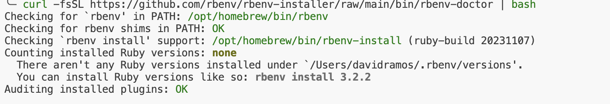

# Install ruby using rbenv

# Install rbenv

```bash
brew install rbenv
```

# Initialize rbenv

```ps
rbenv init
# add :
eval "$(rbenv init - zsh)"
# to ~/.zshrc
```

## Verify if rbenv is installed

```ps
curl -fsSL https://github.com/rbenv/rbenv-installer/raw/main/bin/rbenv-doctor | bash
```

output must be like this:


## List all available ruby versions

```ps
rbenv install -l
```

## Install desired ruby version

```ps
rbenv install <version>
```

## Set the global ruby version

```ps
rbenv global <version>
```

## Verify ruby version

```ps
ruby -v
# Close and reopen terminal if not updated
```
